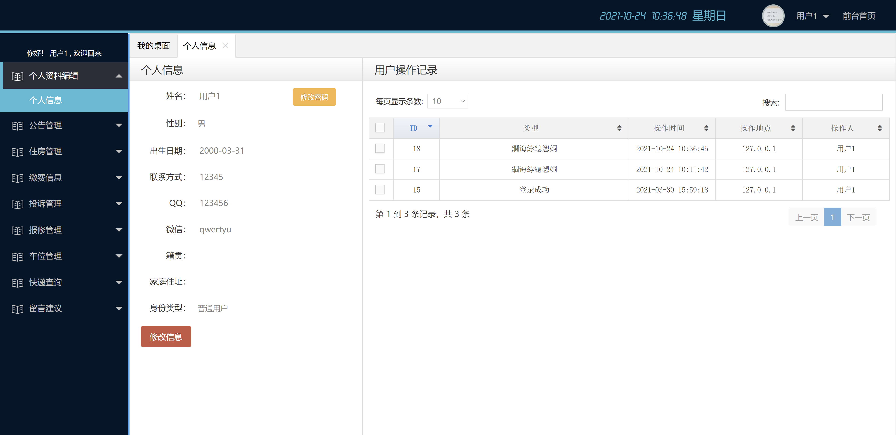
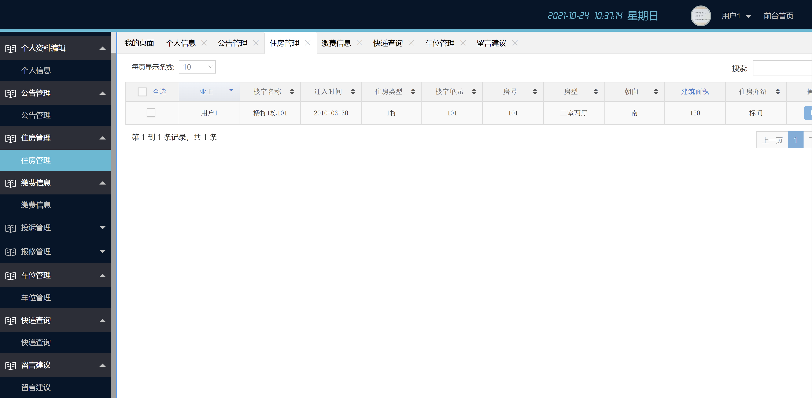
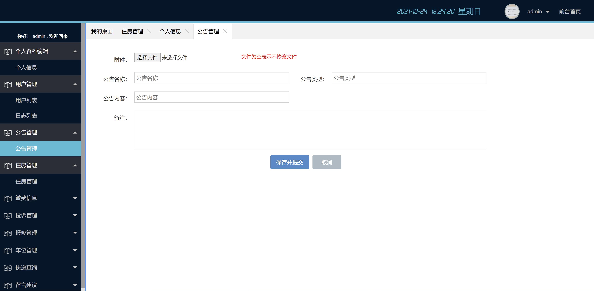
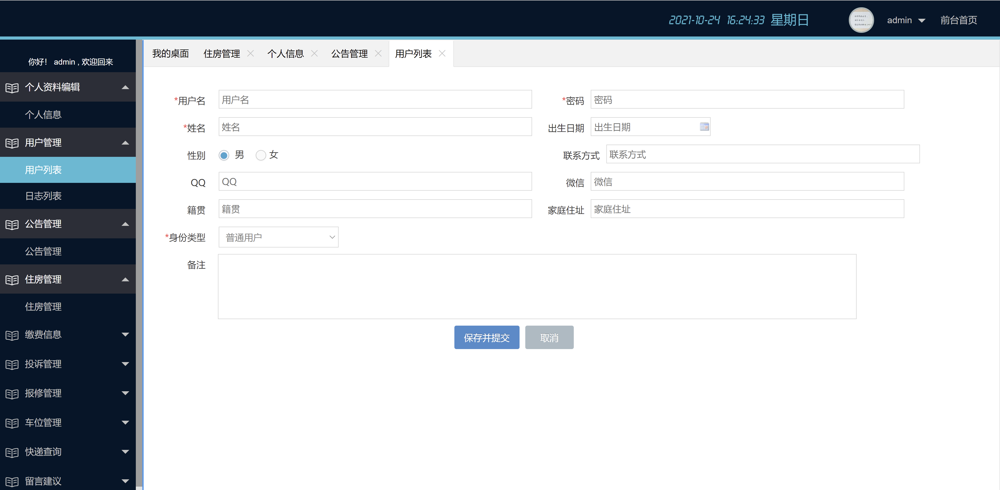

<h1 align="center">小区物业管理系统</h1>

## 简介
小区物业管理系统：角色分为管理员、用户；功能包括用户管理、公告管理、住房管理、投诉管理、缴费信息、快速查询、留言建议。    --计算机毕业设计源码；毕设源码；java毕业设计源码

## 联系方式

<h3 align="center">获取完整代码与数据库文件 + 微信：deepguan QQ: 86050149 QQ群: 783742310</h3>

<h3 align="center">可帮忙远程部署 包运行成功！提供远程部署、修改代码、设计文档指导、代码讲解等服务！</h3>

## 功能介绍（完整见运行截图）
管理员： 基本功能：用户管理，公告管理，房屋管理，投诉管理，报修管理，车位管理，缴费信息管理。 用户信息：查看和编辑用户的基本信息，包括用户名、姓名、性别、联系方式等。 操作记录：跟踪用户的操作记录，包括操作类型、时间和地点，便于管理与监督。

用户： 基本功能：登录，注册，修改个人资料，查看公告和房屋信息。 个人信息：查看和编辑个人信息，如姓名、性别、联系方式、家庭住址等。 投诉与建议：提交投诉和建议，方便物业管理团队及时处理问题。

访客： 基本功能：注册新账号，查看公告和小区信息。 帮助中心：获取注册和使用系统的帮助，联系管理员解决问题。

系统： 功能模块：提供用户管理、公告管理、房屋管理等多种功能。 界面设计：简洁明了，方便用户操作与信息查询，确保信息安全与隐私保护。

## 运行截图

本代码来源于网络,仅供学习参考使用!

